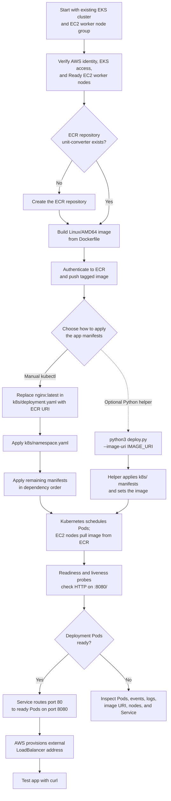

# Manual Kubernetes Deployment Guide

This guide walks through deploying the Unit Converter application to an **existing Amazon EKS cluster** with EC2 worker nodes. The main procedure uses the repository's plain Kubernetes YAML and manual `kubectl` commands. It does not create the cluster or other AWS infrastructure, and it does not use Helm.

The only optional automation described here is `deploy.py`. The manual procedure is the recommended way to learn and verify each deployment step.

## What you will deploy

Kubernetes runs the application in the `unit-converter` namespace. The manifests in `k8s/` create:

| Manifest | Resource / name | What it does |
| --- | --- | --- |
| `namespace.yaml` | Namespace `unit-converter` | Groups this application's Kubernetes resources. |
| `serviceaccount.yaml` | ServiceAccount `unit-converter-sa` | Identity assigned to the application Pods. |
| `role.yaml` | Role `unit-converter-role` | Allows reading ConfigMaps and listing/reading Secrets in this namespace. |
| `rolebinding.yaml` | RoleBinding `unit-converter-rolebinding` | Gives that Role to `unit-converter-sa`. |
| `configmap.yaml` | ConfigMap `unit-converter-config` | Stores Spring properties and is mounted by the Deployment at `/etc/config`; the application must read that path to use them. |
| `deployment.yaml` | Deployment `unit-converter-app`; container `unit-converter` | Starts two Pods on port `8080`, with health probes, CPU request/limit of `250m`/`500m`, memory request/limit of `512Mi`/`1Gi`, and preferred anti-affinity to spread Pods across nodes. The checked-in image is a placeholder and must be replaced as described below. |
| `service.yaml` | Service `unit-converter-service` | Routes port `80` to ready Pods on port `8080` and requests an AWS load balancer. |
| `hpa.yaml` | HPA `unit-converter-hpa` | Targets 2–5 replicas using CPU (70%) and memory (80%) metrics; scaling needs a working resource metrics API. |
| `pdb.yaml` | PodDisruptionBudget `unit-converter-pdb` | Sets `minAvailable: 1` for matching Pods during voluntary disruptions. |

## How the architecture fits together

Think of deployment in two parts: **prepare the application image**, then **tell the existing Kubernetes cluster to run it**. After that, users reach the running application through the Service and AWS load balancer.

### A few terms in plain language

- **EKS cluster:** The Kubernetes environment in AWS. EKS provides the cluster's control plane: the management service that receives instructions and tracks what should be running.
- **EC2 worker node:** A virtual machine that is already part of this cluster. Worker nodes run the application's Pods. In this guide, the EC2 node group and cluster are prerequisites; you do not create them.
- **YAML manifest:** A text file that describes a Kubernetes resource, such as a Deployment or Service. The files in `k8s/` are the instructions you apply to the existing cluster.
- **Container image:** A packaged copy of the application. Docker builds it from this repository's source and `Dockerfile`; ECR (Amazon Elastic Container Registry) stores it so worker nodes can download it.
- **Pod:** The small Kubernetes unit that runs the application container. The Deployment asks Kubernetes to keep two application Pods running.
- **Deployment:** The Kubernetes resource that starts and replaces Pods to maintain the requested number of replicas. Here it is named `unit-converter-app`.
- **Service:** A stable network entry point that sends requests to ready Pods. The `unit-converter-service` listens on port `80` and forwards traffic to the app on port `8080`.
- **Namespace:** A named space inside Kubernetes that groups related resources. This guide uses `unit-converter`.
- **Load balancer:** An AWS network endpoint created when Kubernetes processes this app's `LoadBalancer` Service. People can send requests to its external hostname.

### What already exists, and what this guide creates

Before you begin, the AWS account must already have the EKS cluster, its EC2 worker node group, and the permissions and networking required for the workers to join the cluster and access ECR. You also need access to the ECR repository where you will push the image; the guide helps you check or create the `unit-converter` repository.

Applying the YAML does **not** create the EKS cluster or EC2 worker machines. Instead, it creates Kubernetes resources *inside* that existing cluster: the `unit-converter` namespace, the `unit-converter-app` Deployment and its Pods, the `unit-converter-service` Service, ConfigMap, ServiceAccount and RBAC resources, HPA, and PodDisruptionBudget. Because the Service has `type: LoadBalancer`, Kubernetes also asks AWS to provision an external load balancer for the app.

### Follow the image and request

This picture separates **where resources live** from **how a request travels**. The EKS cluster and the VPC are existing AWS resources; the control plane is AWS-managed, while the EC2 worker nodes run the app's Pods. The app's namespace, Deployment, and Service are Kubernetes resources created by applying the YAML.

```text
AWS account
|
+-- Existing Amazon EKS cluster
|   |
|   +-- AWS-managed control plane
|   |     Receives kubectl instructions and manages the cluster
|   |
|   +-- Kubernetes namespace: unit-converter                 [YAML creates]
|         |
|         +-- Deployment: unit-converter-app                  [YAML creates]
|         |     Requests 2 app Pods and keeps them running
|         |
|         +-- Service: unit-converter-service                 [YAML creates]
|               Type: LoadBalancer; port 80 -> target port 8080
|
+-- Existing VPC (network for the cluster)
    |
    +-- Public subnet(s)
    |     AWS selects subnet(s) for the external load balancer
    |     requested by the Service
    |
    +-- Private subnet(s)
          |
          +-- Existing EC2 worker node(s), registered with the cluster
                |
                +-- Unit Converter Pod(s), scheduled by the Deployment
                      Container: unit-converter; listens on port 8080
```

Image build and traffic are separate short flows:

```text
IMAGE:  your computer (Docker + Dockerfile) -> push -> ECR
        EC2 worker node <- pulls image from ECR <- ECR

REQUEST: browser/curl -> AWS load balancer -> Kubernetes Service
         -> ready Unit Converter Pod on an EC2 worker node
```

The load balancer is requested by the Kubernetes Service. The Service manifest specifies `type: LoadBalancer`, but does not specify an NLB or another specific load-balancer type; AWS provisions it according to the cluster's configuration and subnet tags.

Here is what happens in order:

1. **Package the app.** Docker reads the application source and `Dockerfile` on your computer and builds a container image. You push that image to ECR. The ECR repository stores the package; it does not run the application.
2. **Send instructions to the existing cluster.** For the manual path, `kubectl apply` sends the YAML files to the EKS control plane. `kubectl` is the command-line tool you use to communicate with Kubernetes; it is not where the application runs.
3. **Create app resources inside Kubernetes.** The manifests create the namespace and the Deployment, Service, and supporting resources in that namespace. The Deployment asks Kubernetes to run two Pods. Kubernetes chooses available EC2 worker nodes, and those nodes download the image from ECR and start the app container.
4. **Check whether Pods can receive traffic.** The Deployment has readiness and liveness HTTP probes that check `/` on port `8080`. A Pod that is not ready does not receive Service traffic; repeated liveness failures cause Kubernetes to restart its container.
5. **Route a user's request.** The Service matches ready Pods labeled `app: unit-converter`. AWS provisions the Service's external load balancer. A browser or `curl` request travels from that external hostname to the load balancer, then to the Service on port `80`, and finally to a ready Pod on port `8080`.
6. **Optionally use the Python helper.** `deploy.py --image-uri <your-image-uri>` can apply the manifests and set the Deployment's image for you. It does not build or push the image and does not create the EKS cluster or EC2 workers. The main instructions use manual `kubectl` commands instead.

The checked-in `k8s/deployment.yaml` currently contains `image: nginx:latest`. This is a placeholder, **not** the Unit Converter. Before using the manual apply commands, replace it with the real ECR image URI you pushed. When using `deploy.py`, supply the real URI through its required `--image-uri` option.

### End-to-end Kubernetes deployment workflow

This workflow is for deploying the application to the **existing** cluster; it is not an infrastructure-provisioning or Terraform workflow.



In the manual path, you verify access and worker readiness first, publish an image, replace the placeholder, then apply the namespace and YAML. Kubernetes schedules the Deployment's Pods on the existing EC2 nodes, which pull the image from ECR. Once probes mark Pods ready, the Service routes traffic to them and AWS supplies the external load balancer address. The Python helper is only an alternative for applying the manifests and setting the supplied image; it does not replace the image build/push steps.

## Before you start

You need:

- An existing, running EKS cluster with an EC2 worker node group. This guide assumes the AWS infrastructure has already been created.
- AWS CLI v2 configured with credentials for the intended AWS account. Those credentials need permission to inspect EKS, configure access, and push images to ECR.
- An IAM identity authorized to access the EKS Kubernetes API. AWS CLI credentials alone do not necessarily grant Kubernetes access.
- Docker Desktop or Docker Engine installed and running.
- `kubectl`, Git, Python 3 (only needed for the optional helper), and `curl`.
- A Bash-compatible terminal, such as macOS/Linux Terminal, WSL, or Git Bash. Commands below use Bash syntax.
- A clone of this repository, with commands run from its root directory (the directory containing `Dockerfile`, `deploy.py`, and `k8s/`).

This repository's current EKS configuration uses AWS region `us-east-1`, cluster name `unit-converter-eks`, and node group name `unit-converter-worker-nodes`. Use the values for your **existing** cluster; if it was created with different names or a different region, replace these values in the commands.

## 1. Confirm AWS account and cluster access

Open a terminal at the repository root. Check which AWS account your credentials use before creating or pushing anything:

```bash
aws sts get-caller-identity
```

Confirm the cluster exists and is active:

```bash
aws eks describe-cluster \
  --name unit-converter-eks \
  --region us-east-1 \
  --query 'cluster.status' \
  --output text
```

The result should be `ACTIVE`. Add the cluster's access details to your local `kubectl` configuration:

```bash
aws eks update-kubeconfig \
  --region us-east-1 \
  --name unit-converter-eks
```

Check that `kubectl` is pointed at the intended cluster and can reach it:

```bash
kubectl config current-context
kubectl cluster-info
```

If these commands report an access or connection error, stop and resolve AWS credentials, EKS access permissions, network access, or the selected context before applying any manifests.

## 2. Confirm the EC2 worker nodes are ready

Check the EKS managed node group's status:

```bash
aws eks describe-nodegroup \
  --cluster-name unit-converter-eks \
  --nodegroup-name unit-converter-worker-nodes \
  --region us-east-1 \
  --query 'nodegroup.status' \
  --output text
```

The result should be `ACTIVE`. Then check that Kubernetes sees the EC2 worker nodes and that their `STATUS` is `Ready`:

```bash
kubectl get nodes -o wide
```

If the node group is not `ACTIVE` or nodes are not `Ready`, do not continue; inspect the node group and cluster before deploying the application.

## 3. Build and push the application image to ECR

The root `Dockerfile` builds the Spring Boot application with Java 17 and exposes port `8080`. The checked-in Deployment currently says `image: nginx:latest`. That is a **placeholder image, not the Unit Converter**. You must build and push the actual application image, then replace that placeholder in the manifest before deploying.

### Check or create the ECR repository

Amazon Elastic Container Registry (ECR) is AWS's private container-image registry. The commands below use an ECR repository named `unit-converter` in `us-east-1`. Check whether it exists:

```bash
aws ecr describe-repositories \
  --repository-names unit-converter \
  --region us-east-1
```

If AWS reports that the repository does not exist, create it once:

```bash
aws ecr create-repository \
  --repository-name unit-converter \
  --region us-east-1
```

If you receive an access denied error, your AWS identity needs ECR permissions before continuing.

### Build, authenticate, and push

Use a unique tag for the image. These commands use the current Git revision as a tag and construct the full ECR image URI from your AWS account ID:

```bash
AWS_REGION=us-east-1
AWS_ACCOUNT_ID=$(aws sts get-caller-identity --query Account --output text)
IMAGE_TAG=$(git rev-parse --short HEAD)
IMAGE_URI="${AWS_ACCOUNT_ID}.dkr.ecr.${AWS_REGION}.amazonaws.com/unit-converter:${IMAGE_TAG}"
```

If you have already pushed an image with that tag, choose another tag, for example `IMAGE_TAG="${IMAGE_TAG}-1"`, and recreate `IMAGE_URI` using that tag.

Build a Linux/AMD64 image (the configured worker nodes use `t3.medium` EC2 instances), sign in to ECR, and push it:

```bash
docker build --platform linux/amd64 -t "$IMAGE_URI" .

aws ecr get-login-password --region "$AWS_REGION" |
  docker login --username AWS --password-stdin \
    "${AWS_ACCOUNT_ID}.dkr.ecr.${AWS_REGION}.amazonaws.com"

docker push "$IMAGE_URI"
printf 'Image pushed: %s\n' "$IMAGE_URI"
```

Wait for `docker push` to finish successfully. The AWS identity used to push needs ECR upload permissions. The EC2 worker-node role must be able to pull the image; the role in this repository's EKS configuration has ECR read-only access for a repository in the same AWS account.

## 4. Replace the placeholder image in the manifest

Open `k8s/deployment.yaml` in a text editor. Find this line under the container named `unit-converter`:

```yaml
        image: nginx:latest
```

Replace only the image value with the URI printed in the previous step. For example, use your actual account ID and tag instead of these illustrative values:

```yaml
        image: 123456789012.dkr.ecr.us-east-1.amazonaws.com/unit-converter:abc1234
```

Save the file. The example above is not a real image; use the exact value of your `$IMAGE_URI`. Confirm that the placeholder is gone and the URI is correct before applying:

```bash
grep 'image:' k8s/deployment.yaml
printf 'Expected image: %s\n' "$IMAGE_URI"
```

The two values should match. **Do not apply the Deployment while it still refers to `nginx:latest`.**

## 5. Apply the Kubernetes YAML

`kubectl apply` creates or updates Kubernetes resources from YAML files. Apply them in dependency order from the repository root:

```bash
kubectl apply -f k8s/namespace.yaml
kubectl apply -f k8s/serviceaccount.yaml
kubectl apply -f k8s/role.yaml
kubectl apply -f k8s/rolebinding.yaml
kubectl apply -f k8s/configmap.yaml
kubectl apply -f k8s/deployment.yaml
kubectl apply -f k8s/service.yaml
kubectl apply -f k8s/hpa.yaml
kubectl apply -f k8s/pdb.yaml
```

These commands apply the nine plain YAML manifests in `k8s/`. They do not run Terraform or another deployment script.

Confirm that the resources were created:

```bash
kubectl get deployment,pods,service,hpa,pdb -n unit-converter
```

## 6. Wait for the application and test the Service

Wait for the Deployment's rollout to finish. A rollout is Kubernetes updating the Deployment and waiting for the requested Pods to become ready:

```bash
kubectl rollout status deployment/unit-converter-app \
  --namespace unit-converter \
  --timeout=180s
```

Check Pods, Service, and endpoints:

```bash
kubectl get pods -n unit-converter -o wide
kubectl get service unit-converter-service -n unit-converter
kubectl get endpoints unit-converter-service -n unit-converter
```

Pods should become `Running` and `Ready`; the Service's endpoints should list Pod IP addresses. The Service listens on port `80` and forwards to the application on port `8080`.

Because the Service has type `LoadBalancer`, AWS provisions an external load balancer. This can take a few minutes. Watch its address:

```bash
kubectl get service unit-converter-service \
  --namespace unit-converter \
  --watch
```

When `EXTERNAL-IP` changes from `<pending>` to a hostname, stop watching with Ctrl+C. Use the hostname exactly as displayed (without angle brackets) to test an application page:

```bash
curl --fail --show-error "http://<EXTERNAL-HOSTNAME>/length"
```

Replace `<EXTERNAL-HOSTNAME>` with the value from the Service output. The app has pages at `/length`, `/weight`, and `/temperature`. A successful request returns the page's HTML.

The HPA needs a Kubernetes resource metrics API (commonly Metrics Server). If HPA metrics show `<unknown>`, verify that metrics are available. This does not by itself prevent the Deployment or Service from working.

## Troubleshooting

Start with an overview of the namespace and recent events:

```bash
kubectl get all -n unit-converter
kubectl get events -n unit-converter --sort-by=.lastTimestamp
```

### A Pod is `ImagePullBackOff` or `ErrImagePull`

Kubernetes cannot download the container image. Check that:

- `k8s/deployment.yaml` contains the exact ECR URI and tag that you pushed, not `nginx:latest`.
- The ECR repository and image are in the same region used in that URI.
- The worker-node IAM role can pull from that ECR repository. For a different AWS account, additional repository permissions or image-pull credentials may be required.

Inspect the affected Pod for the precise event:

```bash
kubectl get pods -n unit-converter
kubectl describe pod <pod-name> -n unit-converter
```

### A Pod is pending or not ready

Check the EC2 nodes are `Ready`, then inspect the Pod events and Deployment:

```bash
kubectl get nodes
kubectl describe pod <pod-name> -n unit-converter
kubectl describe deployment unit-converter-app -n unit-converter
```

The Deployment requests CPU and memory for each Pod. The cluster needs enough available resources to schedule them. The readiness probe checks the application on port `8080`.

### A Pod starts and then restarts

Read its logs and recent events:

```bash
kubectl logs <pod-name> -n unit-converter
kubectl describe pod <pod-name> -n unit-converter
```

### The Service has no endpoints or no external address

An empty endpoint list usually means there are no ready Pods matching the Service selector. Check Pod readiness and the `app: unit-converter` labels. If the external address remains `<pending>`, inspect the Service and events; AWS may still be provisioning the load balancer, or the cluster networking/IAM configuration may need attention.

```bash
kubectl get pods --show-labels -n unit-converter
kubectl get endpoints unit-converter-service -n unit-converter
kubectl describe service unit-converter-service -n unit-converter
kubectl get events -n unit-converter --sort-by=.lastTimestamp
```

## Common operations after deployment

Run these commands from a terminal configured for the same EKS cluster. Most inspect or change resources in the `unit-converter` namespace; `kubectl top nodes` reports node-level metrics.

### Check status and application logs

```bash
kubectl get deployment,pods,service,hpa,pdb -n unit-converter
kubectl get pods -n unit-converter -o wide
kubectl logs -n unit-converter -l app=unit-converter --all-containers=true --tail=100
```

Add `-f` to follow the logs as the application writes them. For one Pod, use `kubectl logs <pod-name> -n unit-converter`; if its container restarted, add `--previous` to see the previous container's logs. To see why a resource is not ready, use `kubectl describe pod <pod-name> -n unit-converter` and `kubectl get events -n unit-converter --sort-by=.lastTimestamp`.

### Scale and check autoscaling

The Deployment starts with two replicas. The HPA can adjust that count between two and five according to the configured CPU and memory targets (70% and 80%). Check its status and whether metrics are available:

```bash
kubectl get hpa unit-converter-hpa -n unit-converter
kubectl describe hpa unit-converter-hpa -n unit-converter
kubectl top nodes
kubectl top pods -n unit-converter
```

`kubectl top` and HPA decisions require the cluster's resource metrics API. If values are unavailable or `<unknown>`, check the metrics provider before treating autoscaling as active. To request a replica count manually:

```bash
kubectl scale deployment/unit-converter-app \
  --namespace unit-converter \
  --replicas=3
```

When HPA is active, it may later adjust the manually requested count within its configured range.

### Update the application image

Build and push a new uniquely tagged image using the ECR steps above. Update the `image:` value in `k8s/deployment.yaml` to that image URI, then apply the Deployment and wait for the rollout:

```bash
kubectl apply -f k8s/deployment.yaml
kubectl rollout status deployment/unit-converter-app -n unit-converter --timeout=180s
kubectl rollout history deployment/unit-converter-app -n unit-converter
```

Keep the manifest's image URI in sync with the deployed image so a future apply does not restore an older image. To restart the Pods without changing the image:

```bash
kubectl rollout restart deployment/unit-converter-app -n unit-converter
kubectl rollout status deployment/unit-converter-app -n unit-converter --timeout=180s
```

If a new rollout fails, inspect the Pods and events first. You can return the live Deployment to its prior revision with:

```bash
kubectl rollout history deployment/unit-converter-app -n unit-converter
kubectl rollout undo deployment/unit-converter-app -n unit-converter
```

After a rollback, update `k8s/deployment.yaml` to the intended image before applying it again; otherwise the next apply may restore the failed image.

### Update the ConfigMap

The ConfigMap file is mounted at `/etc/config` in each Pod. If you change `k8s/configmap.yaml`, apply it with:

```bash
kubectl apply -f k8s/configmap.yaml
```

The mounted file and application behavior are not the same thing: the application must be configured to read `/etc/config/application.properties` for those values to affect it. Confirm the app's Spring Boot configuration before relying on a ConfigMap edit. A process may also need restarting to reload changed settings:

```bash
kubectl rollout restart deployment/unit-converter-app -n unit-converter
kubectl rollout status deployment/unit-converter-app -n unit-converter --timeout=180s
```

## Optional: use the Python deployment helper

The manual `kubectl` steps above are the primary deployment procedure. If you prefer the repository's Python helper, first complete the AWS/ECR steps above and set the real image URI in the same Bash terminal. From the repository root, run:

```bash
python3 deploy.py --image-uri "$IMAGE_URI"
```

The helper checks for `aws` and `kubectl`, checks cluster connectivity, applies manifests from `./k8s`, sets the `unit-converter` container to the supplied image, and waits for the Deployment. It also waits for the Service endpoint and prints it if one appears. It **does not build or push** the image, so do not run it until the real image exists in ECR. If the endpoint is not printed, check it manually using the Service commands above. Python 3 is required; no other deployment script is part of this guide.

## Cleanup

Delete the application's Kubernetes namespace when you are finished with it. This removes its Kubernetes resources and requests deletion of the AWS load balancer. Load balancer cleanup may take several minutes:

```bash
kubectl delete namespace unit-converter
```

This command does **not** delete the EKS cluster, EC2 worker nodes, or ECR repository. Keep those resources if they are used by anything else; remove them separately only when you are sure they are no longer needed.
