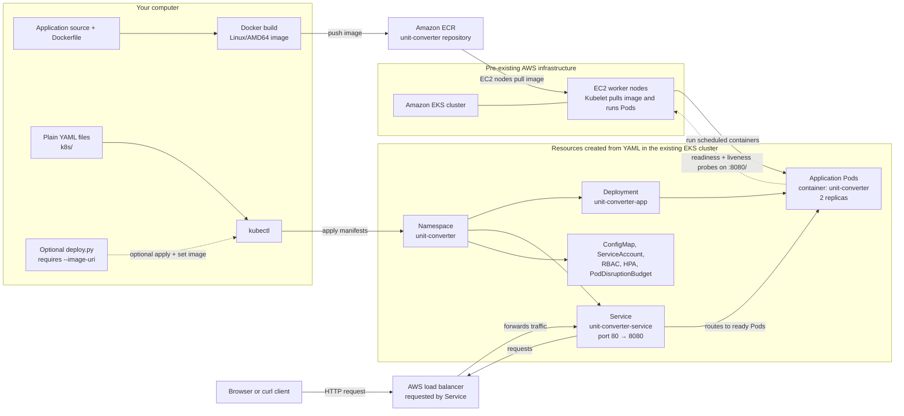
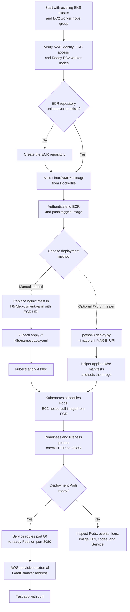

# Manual Kubernetes Deployment Guide

This guide walks through deploying the Unit Converter application to an **existing Amazon EKS cluster** with EC2 worker nodes. The main procedure uses the repository's plain Kubernetes YAML and manual `kubectl` commands. It does not create the cluster or other AWS infrastructure, and it does not use Helm.

The only optional automation described here is `deploy.py`. The manual procedure is the recommended way to learn and verify each deployment step.

## What you will deploy

Kubernetes runs the application in the `unit-converter` namespace. The manifests in `k8s/` create:

| Resource | Name | Purpose |
| --- | --- | --- |
| Namespace | `unit-converter` | Keeps this application's Kubernetes resources together. |
| Deployment | `unit-converter-app` | Runs two application Pods and replaces unhealthy or outdated Pods. |
| Container | `unit-converter` | Runs the Spring Boot application inside each Pod on port `8080`. |
| Service | `unit-converter-service` | Routes traffic from port `80` to ready Pods on port `8080` and requests an AWS load balancer. |
| ConfigMap | `unit-converter-config` | Supplies the application's configuration file. |
| ServiceAccount, Role, RoleBinding | `unit-converter-sa`, `unit-converter-role`, `unit-converter-rolebinding` | Set the identity and Kubernetes permissions used by the Pods. |
| HPA | `unit-converter-hpa` | Can scale the Deployment from 2 to 5 replicas when resource metrics are available. |
| PodDisruptionBudget | `unit-converter-pdb` | Helps keep at least one Pod available during voluntary disruption. |

An **image** is the packaged application that Docker builds; ECR stores that image. A **Pod** is the unit Kubernetes runs, and contains the application container. A **Deployment** maintains the desired number of Pods. A **Service** provides a stable network address for those Pods.

## Architecture and request flow

The EKS cluster and its EC2 worker node group already exist before following this guide. Docker builds the application image on your computer and pushes it to ECR; the nodes later pull that image when Kubernetes starts the Pods. The Kubernetes resources inside the `unit-converter` namespace are created by applying the repository's YAML manifests.



### Following the diagram

1. **Build and publish the image.** Docker uses the repository's `Dockerfile` and application source to create a Linux/AMD64 image on your computer. You push the image to the `unit-converter` ECR repository. When a Pod is scheduled, the EC2 node pulls the image from ECR. This is why the ECR image must exist and the worker nodes must be able to read it before the Deployment can become ready.
2. **Apply the manifests.** In the main workflow, you use `kubectl apply` to send the plain files in `k8s/` to the existing EKS cluster. The files create the `unit-converter` namespace and its ConfigMap, service account and RBAC resources, Deployment, Service, HPA, and PodDisruptionBudget. Kubernetes creates the Pods described by the Deployment. The checked-in Deployment image `nginx:latest` is only a placeholder; replace it with the pushed ECR URI before applying.
3. **Serve requests.** The Service selects Pods with the `app: unit-converter` label. It exposes port `80` and forwards requests to port `8080` on ready Pods. As a `LoadBalancer` Service, it asks the AWS integration for a load balancer; once provisioned, clients can send HTTP requests to its external hostname.
4. **Check application health.** The Deployment defines readiness and liveness HTTP probes against `/` on port `8080`. Readiness controls whether a Pod receives Service traffic. Liveness lets Kubernetes restart a container that repeatedly fails its health check.
5. **Optional helper.** `deploy.py` is an alternative way to apply the same manifests and set the image with the supplied `--image-uri`; it does not build or push the image. It is not needed for the manual `kubectl` flow, and it does not create the existing EKS cluster, EC2 workers, or ECR repository.

### End-to-end workflow

This second diagram shows the order of operations. The EKS cluster and EC2 node group are prerequisites; steps inside the Kubernetes namespace happen only after you apply the manifests.



In the manual path, you verify access and worker readiness first, publish an image, replace the placeholder, then apply the namespace and YAML. Kubernetes schedules the Deployment's Pods on the existing EC2 nodes, which pull the image from ECR. Once probes mark Pods ready, the Service routes traffic to them and AWS supplies the external load balancer address. The Python helper is only an alternative for applying the manifests and setting the supplied image; it does not replace the image build/push steps.

## Before you start

You need:

- An existing, running EKS cluster with an EC2 worker node group. This guide assumes the AWS infrastructure has already been created.
- AWS CLI v2 configured with credentials for the intended AWS account. Those credentials need permission to inspect EKS, configure access, and push images to ECR.
- An IAM identity authorized to access the EKS Kubernetes API. AWS CLI credentials alone do not necessarily grant Kubernetes access.
- Docker Desktop or Docker Engine installed and running.
- `kubectl`, Git, Python 3 (only needed for the optional helper), and `curl`.
- A Bash-compatible terminal, such as macOS/Linux Terminal, WSL, or Git Bash. Commands below use Bash syntax.
- A clone of this repository, with commands run from its root directory (the directory containing `Dockerfile`, `deploy.py`, and `k8s/`).

This repository's current EKS configuration uses AWS region `us-east-1`, cluster name `unit-converter-eks`, and node group name `unit-converter-worker-nodes`. Use the values for your **existing** cluster; if it was created with different names or a different region, replace these values in the commands.

## 1. Confirm AWS account and cluster access

Open a terminal at the repository root. Check which AWS account your credentials use before creating or pushing anything:

```bash
aws sts get-caller-identity
```

Confirm the cluster exists and is active:

```bash
aws eks describe-cluster \
  --name unit-converter-eks \
  --region us-east-1 \
  --query 'cluster.status' \
  --output text
```

The result should be `ACTIVE`. Add the cluster's access details to your local `kubectl` configuration:

```bash
aws eks update-kubeconfig \
  --region us-east-1 \
  --name unit-converter-eks
```

Check that `kubectl` is pointed at the intended cluster and can reach it:

```bash
kubectl config current-context
kubectl cluster-info
```

If these commands report an access or connection error, stop and resolve AWS credentials, EKS access permissions, network access, or the selected context before applying any manifests.

## 2. Confirm the EC2 worker nodes are ready

Check the EKS managed node group's status:

```bash
aws eks describe-nodegroup \
  --cluster-name unit-converter-eks \
  --nodegroup-name unit-converter-worker-nodes \
  --region us-east-1 \
  --query 'nodegroup.status' \
  --output text
```

The result should be `ACTIVE`. Then check that Kubernetes sees the EC2 worker nodes and that their `STATUS` is `Ready`:

```bash
kubectl get nodes -o wide
```

If the node group is not `ACTIVE` or nodes are not `Ready`, do not continue; inspect the node group and cluster before deploying the application.

## 3. Build and push the application image to ECR

The root `Dockerfile` builds the Spring Boot application with Java 17 and exposes port `8080`. The checked-in Deployment currently says `image: nginx:latest`. That is a **placeholder image, not the Unit Converter**. You must build and push the actual application image, then replace that placeholder in the manifest before deploying.

### Check or create the ECR repository

Amazon Elastic Container Registry (ECR) is AWS's private container-image registry. The commands below use an ECR repository named `unit-converter` in `us-east-1`. Check whether it exists:

```bash
aws ecr describe-repositories \
  --repository-names unit-converter \
  --region us-east-1
```

If AWS reports that the repository does not exist, create it once:

```bash
aws ecr create-repository \
  --repository-name unit-converter \
  --region us-east-1
```

If you receive an access denied error, your AWS identity needs ECR permissions before continuing.

### Build, authenticate, and push

Use a unique tag for the image. These commands use the current Git revision as a tag and construct the full ECR image URI from your AWS account ID:

```bash
AWS_REGION=us-east-1
AWS_ACCOUNT_ID=$(aws sts get-caller-identity --query Account --output text)
IMAGE_TAG=$(git rev-parse --short HEAD)
IMAGE_URI="${AWS_ACCOUNT_ID}.dkr.ecr.${AWS_REGION}.amazonaws.com/unit-converter:${IMAGE_TAG}"
```

If you have already pushed an image with that tag, choose another tag, for example `IMAGE_TAG="${IMAGE_TAG}-1"`, and recreate `IMAGE_URI` using that tag.

Build a Linux/AMD64 image (the configured worker nodes use `t3.medium` EC2 instances), sign in to ECR, and push it:

```bash
docker build --platform linux/amd64 -t "$IMAGE_URI" .

aws ecr get-login-password --region "$AWS_REGION" |
  docker login --username AWS --password-stdin \
    "${AWS_ACCOUNT_ID}.dkr.ecr.${AWS_REGION}.amazonaws.com"

docker push "$IMAGE_URI"
printf 'Image pushed: %s\n' "$IMAGE_URI"
```

Wait for `docker push` to finish successfully. The AWS identity used to push needs ECR upload permissions. The EC2 worker-node role must be able to pull the image; the role in this repository's EKS configuration has ECR read-only access for a repository in the same AWS account.

## 4. Replace the placeholder image in the manifest

Open `k8s/deployment.yaml` in a text editor. Find this line under the container named `unit-converter`:

```yaml
        image: nginx:latest
```

Replace only the image value with the URI printed in the previous step. For example, use your actual account ID and tag instead of these illustrative values:

```yaml
        image: 123456789012.dkr.ecr.us-east-1.amazonaws.com/unit-converter:abc1234
```

Save the file. The example above is not a real image; use the exact value of your `$IMAGE_URI`. Confirm that the placeholder is gone and the URI is correct before applying:

```bash
grep 'image:' k8s/deployment.yaml
printf 'Expected image: %s\n' "$IMAGE_URI"
```

The two values should match. **Do not apply the Deployment while it still refers to `nginx:latest`.**

## 5. Apply the Kubernetes YAML

`kubectl apply` creates or updates Kubernetes resources from YAML files. First create the namespace; then apply the rest of the plain YAML from the `k8s/` directory:

```bash
kubectl apply -f k8s/namespace.yaml
kubectl apply -f k8s/
```

The second command applies the nine manifests in `k8s/`; it includes the namespace manifest again, which is safe. The commands do not run Terraform or any other deployment script.

Confirm that the resources were created:

```bash
kubectl get deployment,pods,service,hpa,pdb -n unit-converter
```

## 6. Wait for the application and test the Service

Wait for the Deployment's rollout to finish. A rollout is Kubernetes updating the Deployment and waiting for the requested Pods to become ready:

```bash
kubectl rollout status deployment/unit-converter-app \
  --namespace unit-converter \
  --timeout=180s
```

Check Pods, Service, and endpoints:

```bash
kubectl get pods -n unit-converter -o wide
kubectl get service unit-converter-service -n unit-converter
kubectl get endpoints unit-converter-service -n unit-converter
```

Pods should become `Running` and `Ready`; the Service's endpoints should list Pod IP addresses. The Service listens on port `80` and forwards to the application on port `8080`.

Because the Service has type `LoadBalancer`, AWS provisions an external load balancer. This can take a few minutes. Watch its address:

```bash
kubectl get service unit-converter-service \
  --namespace unit-converter \
  --watch
```

When `EXTERNAL-IP` changes from `<pending>` to a hostname, stop watching with Ctrl+C. Use the hostname exactly as displayed (without angle brackets) to test an application page:

```bash
curl --fail --show-error "http://<EXTERNAL-HOSTNAME>/length"
```

Replace `<EXTERNAL-HOSTNAME>` with the value from the Service output. The app has pages at `/length`, `/weight`, and `/temperature`. A successful request returns the page's HTML.

The HPA needs a Kubernetes resource metrics API (commonly Metrics Server). If HPA metrics show `<unknown>`, verify that metrics are available. This does not by itself prevent the Deployment or Service from working.

## Troubleshooting

Start with an overview of the namespace and recent events:

```bash
kubectl get all -n unit-converter
kubectl get events -n unit-converter --sort-by=.lastTimestamp
```

### A Pod is `ImagePullBackOff` or `ErrImagePull`

Kubernetes cannot download the container image. Check that:

- `k8s/deployment.yaml` contains the exact ECR URI and tag that you pushed, not `nginx:latest`.
- The ECR repository and image are in the same region used in that URI.
- The worker-node IAM role can pull from that ECR repository. For a different AWS account, additional repository permissions or image-pull credentials may be required.

Inspect the affected Pod for the precise event:

```bash
kubectl get pods -n unit-converter
kubectl describe pod <pod-name> -n unit-converter
```

### A Pod is pending or not ready

Check the EC2 nodes are `Ready`, then inspect the Pod events and Deployment:

```bash
kubectl get nodes
kubectl describe pod <pod-name> -n unit-converter
kubectl describe deployment unit-converter-app -n unit-converter
```

The Deployment requests CPU and memory for each Pod. The cluster needs enough available resources to schedule them. The readiness probe checks the application on port `8080`.

### A Pod starts and then restarts

Read its logs and recent events:

```bash
kubectl logs <pod-name> -n unit-converter
kubectl describe pod <pod-name> -n unit-converter
```

### The Service has no endpoints or no external address

An empty endpoint list usually means there are no ready Pods matching the Service selector. Check Pod readiness and the `app: unit-converter` labels. If the external address remains `<pending>`, inspect the Service and events; AWS may still be provisioning the load balancer, or the cluster networking/IAM configuration may need attention.

```bash
kubectl get pods --show-labels -n unit-converter
kubectl get endpoints unit-converter-service -n unit-converter
kubectl describe service unit-converter-service -n unit-converter
kubectl get events -n unit-converter --sort-by=.lastTimestamp
```

## Optional: use the Python deployment helper

The manual `kubectl` steps above are the primary deployment procedure. If you prefer the repository's Python helper, first complete the AWS/ECR steps above and set the real image URI in the same Bash terminal. From the repository root, run:

```bash
python3 deploy.py --image-uri "$IMAGE_URI"
```

The helper checks for `aws` and `kubectl`, checks cluster connectivity, applies manifests from `./k8s`, sets the `unit-converter` container to the supplied image, and waits for the Deployment. It also waits for the Service endpoint and prints it if one appears. It **does not build or push** the image, so do not run it until the real image exists in ECR. If the endpoint is not printed, check it manually using the Service commands above. Python 3 is required; no other deployment script is part of this guide.

## Cleanup

Delete the application's Kubernetes namespace when you are finished with it. This removes its Kubernetes resources and requests deletion of the AWS load balancer. Load balancer cleanup may take several minutes:

```bash
kubectl delete namespace unit-converter
```

This command does **not** delete the EKS cluster, EC2 worker nodes, or ECR repository. Keep those resources if they are used by anything else; remove them separately only when you are sure they are no longer needed.
