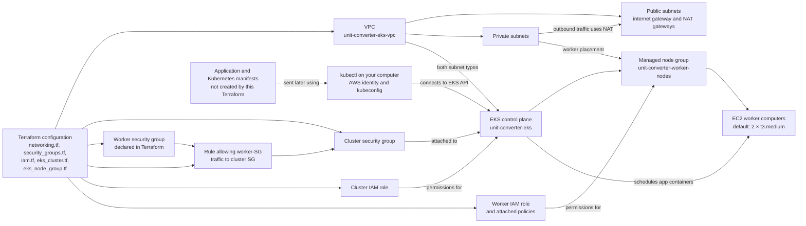

# Beginner's Guide: Deploying AWS EKS with Terraform

This guide walks through the Terraform configuration in `eks-terraform/`. It creates an Amazon EKS Kubernetes control plane and an EC2-backed managed worker node group, together with the VPC networking and IAM resources they need. It does **not** deploy the unit-converter application or its Kubernetes manifests.

The checked-in configuration defaults to AWS region `us-east-1`, cluster `unit-converter-eks`, Kubernetes `1.29`, and two `t3.medium` worker instances. Confirm that the requested Kubernetes version is still supported by Amazon EKS in your selected region before creating the cluster.

## What you are creating

- **Terraform** reads the configuration files, shows the proposed AWS changes, and can create or remove those resources. It records the resources it manages in a state file.
- **Amazon EKS** is AWS's managed Kubernetes control plane. AWS runs the control-plane components; the Terraform configuration creates the cluster and its supporting IAM role.
- **A VPC** is an isolated network in your AWS account. This configuration creates public and private subnets across two availability zones, an internet gateway, and NAT gateways. The worker nodes use private subnets; NAT gateways let them reach required external AWS services without assigning them public IP addresses.
- **The managed node group** is the group of EC2 virtual machines that run Kubernetes workloads. The current defaults request two `t3.medium` instances, with a minimum of one and a maximum of four.
- **IAM roles and security groups** grant AWS services the permissions and network access needed for the cluster and its worker nodes.

## How the architecture fits together

Terraform reads the files in `eks-terraform/` and creates the AWS infrastructure shown below. A **VPC** is the private network for this cluster. It contains public and private **subnets**, which are smaller network areas: the public subnets connect to the internet, while the EC2 worker computers are placed in private subnets. NAT gateways give those private subnets a way to make outbound connections without giving worker computers public IP addresses.

Amazon EKS runs the Kubernetes **control plane** (the part that manages the cluster) for you. Terraform connects it to both kinds of subnet and gives it an IAM role, which is its AWS permission identity. A **managed node group** is the AWS-managed group of EC2 worker computers that run applications. It uses the private subnets and a separate IAM role for the workers. The configuration requests two `t3.medium` workers by default.

Security groups are AWS network rules. This configuration puts the cluster security group on the EKS cluster and also declares a worker security group and a rule referring to it. The managed node-group resource does not explicitly attach that worker security group; the diagram and explanation reflect what the Terraform files declare.



This Terraform module creates the AWS infrastructure only. It does not create the unit-converter application, Kubernetes Deployments, or Services. After the EKS cluster and worker computers are ready, you can use `kubectl` to send Kubernetes manifests to the cluster. Kubernetes then schedules the application's containers onto the EC2 workers. The later app deployment is separate from this Terraform configuration.

## 1. Prerequisites

Install these tools on your computer:

- [Terraform](https://developer.hashicorp.com/terraform/install), version 1.0 or later. The AWS provider is constrained to the `~> 5.0` series by `main.tf`.
- [AWS CLI](https://docs.aws.amazon.com/cli/latest/userguide/getting-started-install.html), configured with credentials for the AWS account where you will create the cluster.
- [`kubectl`](https://kubernetes.io/docs/tasks/tools/), to connect to and inspect the Kubernetes cluster after it is created.
- Git, and a clone of this repository.

The AWS identity you use needs permission to create and manage the resources in the plan, including EKS, EC2/VPC, IAM roles and policy attachments, and CloudWatch log groups. Your organization's IAM policies may also require an administrator to grant `iam:PassRole` for the cluster and worker roles.

Check that the tools are available and that the AWS CLI is using the expected account:

```sh
terraform version
aws --version
kubectl version --client
aws sts get-caller-identity
```

If you use a named AWS CLI profile, add `--profile YOUR_PROFILE` to AWS CLI commands, or set `AWS_PROFILE` in your shell before running Terraform and AWS CLI commands. Do not put AWS access keys in the Terraform files.

## 2. Review and customize the configuration

From the repository root, review `eks-terraform/variables.tf` for the available Terraform inputs and `eks-terraform/terraform.tfvars` for the values used by default. Terraform automatically loads this `.tfvars` file when you run commands from `eks-terraform/`.

The checked-in values are:

| Setting | Default |
|---|---|
| AWS region | `us-east-1` |
| Cluster name | `unit-converter-eks` |
| Kubernetes version | `1.29` |
| VPC CIDR | `10.0.0.0/16` |
| Public subnet CIDRs | `10.0.1.0/24`, `10.0.2.0/24` |
| Private subnet CIDRs | `10.0.101.0/24`, `10.0.102.0/24` |
| Node group name | `unit-converter-worker-nodes` |
| EC2 instance type | `t3.medium` |
| Desired / minimum / maximum worker count | `2 / 1 / 4` |
| CloudWatch log retention | `7` days |

Edit `terraform.tfvars` to customize the deployment. For example, choose a Kubernetes version available in your region and an EC2 instance type suitable for your workload. The subnet CIDR ranges must not overlap with each other or with networks that need to connect to this VPC. The public and private subnet lists are used together to create subnets and NAT gateways; keep their lengths aligned when changing the availability-zone layout.

The Terraform files are all part of one module and are loaded together. The main files are:

- `main.tf`: Terraform and AWS provider requirements and provider region.
- `variables.tf` and `terraform.tfvars`: input definitions and the checked-in input values.
- `networking.tf`: VPC, subnets, internet gateway, NAT gateways, and route tables.
- `security_groups.tf`: cluster and worker-node security groups and their rule.
- `iam.tf`: EKS and EC2 IAM roles, attached AWS policies, and worker instance profile.
- `eks_cluster.tf`: EKS control plane and CloudWatch log group.
- `eks_node_group.tf`: EC2-backed EKS managed node group.
- `outputs.tf`: useful cluster, networking, node group, and kubeconfig outputs.

## 3. Initialize and validate Terraform

Open a terminal at the repository root and change to the Terraform module directory:

```sh
cd eks-terraform
```

Initialize the working directory. This downloads the AWS provider required by the configuration; it does not create AWS infrastructure:

```sh
terraform init
```

Format and check the Terraform files:

```sh
terraform fmt -recursive
terraform fmt -check -recursive
```

Validate the configuration syntax and internal references:

```sh
terraform validate
```

`terraform validate` requires the provider plugins installed by `terraform init`, but does not need AWS credentials and does not provision resources.

## 4. Review the plan, then apply

Create a plan and read the proposed changes carefully:

```sh
terraform plan
```

The plan should include the EKS cluster, managed node group, VPC and networking, security groups, IAM roles/policies, and CloudWatch log group. It should not include application deployments or Kubernetes manifests. Check the selected region, Kubernetes version, subnet ranges, worker instance type/count, and expected costs before continuing.

If the plan is what you intend to create, apply it:

```sh
terraform apply
```

Terraform shows the plan again and asks for confirmation. Type `yes` only after reviewing it. Cluster and node-group creation can take several minutes. Do not run `terraform apply` if you are only reviewing this repository or do not have authorization to create the AWS resources.

## 5. Read outputs and configure kubectl

When apply finishes, display the values returned by the configuration:

```sh
terraform output
```

Outputs include the cluster ID, ARN, API endpoint and Kubernetes version; cluster and worker security group IDs; managed node-group ID and status; VPC and subnet IDs; and a `configure_kubectl` command.

Configure the current `kubectl` context with the output command:

```sh
terraform output -raw configure_kubectl
```

Copy and run the command it prints. With the checked-in values, it is:

```sh
aws eks update-kubeconfig --region us-east-1 --name unit-converter-eks
```

This updates your local kubeconfig, normally at `~/.kube/config`; it does not change the cluster. If you use a named AWS profile, ensure the profile is available to both AWS CLI and `kubectl` authentication.

## 6. Verify the cluster and EC2 worker nodes

Check that AWS reports the cluster as active:

```sh
aws eks describe-cluster \
  --region us-east-1 \
  --name unit-converter-eks \
  --query 'cluster.status' \
  --output text
```

Check that the managed node group is active and review its instance type and scaling settings:

```sh
aws eks describe-nodegroup \
  --region us-east-1 \
  --cluster-name unit-converter-eks \
  --nodegroup-name unit-converter-worker-nodes \
  --query 'nodegroup.{Status:status,InstanceTypes:instanceTypes,Scaling:scalingConfig}' \
  --output table
```

The node-group status should be `ACTIVE`. Then confirm that Kubernetes can reach the cluster and see its worker nodes:

```sh
kubectl get nodes -o wide
kubectl get nodes -L node.kubernetes.io/instance-type,eks.amazonaws.com/nodegroup
```

With the default values, the nodes should report `t3.medium` and node group `unit-converter-worker-nodes`. If you changed `aws_region`, `cluster_name`, or `node_group_name` in `terraform.tfvars`, use those values in the AWS CLI commands above.

## Costs and security notes

Creating these resources can incur AWS charges. In particular, EKS control planes, EC2 worker instances, NAT gateways, Elastic IP addresses, data transfer, and CloudWatch logs may be billed while the environment exists. Two NAT gateways are created from the default two public subnets. Review current AWS pricing for your region and clean up resources when finished.

The EKS API endpoint is configured for both private and public access. Protect AWS credentials and kubeconfig files, limit who can assume the IAM roles or access the cluster, and review the security-group rules and IAM permissions before using this configuration in a production account. Do not commit Terraform state, AWS credentials, or other secrets.

## Troubleshooting

- **Terraform cannot find credentials or AWS returns `AccessDenied`:** check `aws sts get-caller-identity`, the selected AWS CLI profile, and whether your identity has the required AWS permissions.
- **The selected Kubernetes version is unavailable:** update `kubernetes_version` in `terraform.tfvars` to a version supported by EKS in the selected region, then run `terraform plan` again.
- **Terraform cannot download the AWS provider:** check network access to the Terraform registry and HashiCorp provider releases, then retry `terraform init`.
- **The node group is not `ACTIVE` or no nodes appear:** inspect `aws eks describe-nodegroup` and its health issues, wait for provisioning to finish, and verify that the worker role and network resources were created successfully.
- **`kubectl` cannot connect or returns an authorization error:** rerun the `aws eks update-kubeconfig` command for the correct region and cluster, confirm the active AWS identity, and ensure that identity is authorized to access the EKS cluster.
- **A plan proposes unexpected changes:** stop before applying. Confirm that you are in `eks-terraform/`, using the expected AWS account/profile and `terraform.tfvars`, and review the plan and Terraform state.

## Safely destroy the environment

When you no longer need this environment, return to the same `eks-terraform/` directory and AWS account/profile that you used to create it. First preview what Terraform intends to remove:

```sh
terraform plan -destroy
```

If the plan contains only resources belonging to this environment and you are certain they should be removed, run:

```sh
terraform destroy
```

Review the displayed plan and type `yes` to confirm. Destroying the cluster removes the EKS control plane and its managed worker group along with the Terraform-managed network, IAM, and logging resources. It does not remove local kubeconfig entries or unrelated resources. Keep Terraform state until destroy completes successfully; do not manually delete the state file as a substitute for destroying resources.
